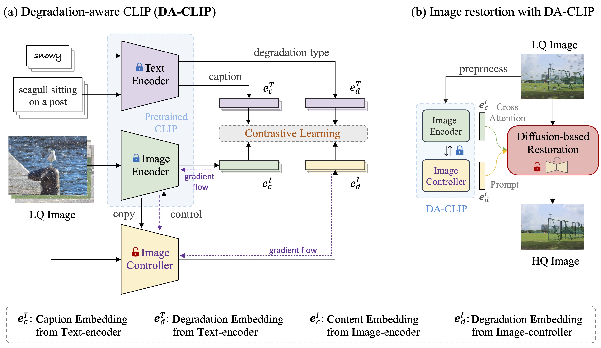
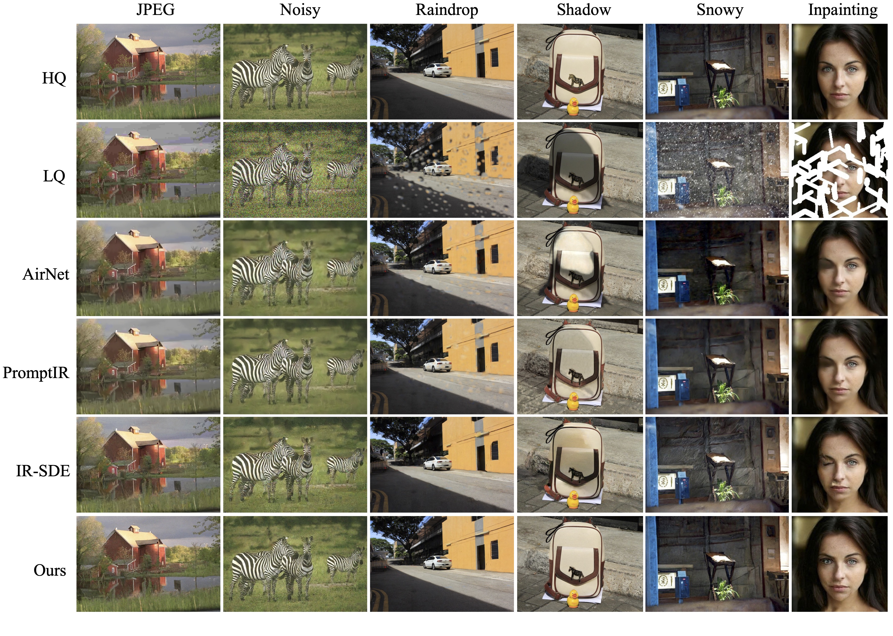

## 	Controlling Vision-Language Models for Universal Image Restoration <br><sub>Official PyTorch Implementation of DA-CLIP. </sub>

[Project Page](https://algolzw.github.io/daclip-uir) | [Paper](https://arxiv.org/abs/2310.01018) | [Model Card 🤗](https://huggingface.co/weblzw/daclip-uir-ViT-B-32-irsde)

[](https://colab.research.google.com/github/camenduru/daclip-uir-colab/blob/main/daclip_uir_gradio_colab.ipynb) [](https://huggingface.co/spaces/fffiloni/DA-CLIP) [](https://replicate.com/cjwbw/daclip-uir) 


### Overview framework:



### Updates

[**2023.10.25**] Added [dataset links](https://github.com/Algolzw/daclip-uir#dataset-links) for training and testing. <br>
[**2023.10.13**] Added the Replicate [demo](https://replicate.com/cjwbw/daclip-uir) and [api](https://replicate.com/cjwbw/daclip-uir/api)🔥. Thanks to [@chenxwh](https://github.com/chenxwh)!!! We updated the Hugging Face [demo](https://huggingface.co/spaces/fffiloni/DA-CLIP)🔥 and online Colab [demo](https://colab.research.google.com/github/camenduru/daclip-uir-colab/blob/main/daclip_uir_gradio_colab.ipynb)🔥. Thanks to [@fffiloni](https://github.com/fffiloni) and [@camenduru](https://github.com/camenduru) !!! We also made a [Model Card](https://huggingface.co/weblzw/daclip-uir-ViT-B-32-irsde) in Hugging Face 🤗 and provided more [examples](https://drive.google.com/file/d/1C1nmP5kJXzxrULxTMVWF5P30qezqP6kn/view?usp=sharing) for testing.<br>
[**2023.10.09**] The **pretrained weights** of DA-CLIP and the Universal IR model are released in [link1](https://drive.google.com/file/d/1A6u4CaVrcpcZckGUNzEXqMF8x_JXsZdX/view?usp=sharing) and [link2](https://drive.google.com/file/d/1eXsyrmAbWOvhIY4Wbt5v4IxaggA5aZMG/view?usp=sharing), respectively. In addition, we also provide a [Gradio](https://gradio.app/) app file for the case that you want to [test your own images](https://github.com/Algolzw/daclip-uir#Gradio).<br>

#### Notice!!

🙁 In testing we found that the current pretrained model is still difficult to process some real-world images  which might have distribution shifts with our training dataset (captured from different devices or with different resolutions or degradations). We regard it as a future work and will try to make our model more practical! We also encourage users who are interested in our work to train their own models with larger dataset and more degradation types.

🙁 BTW, **we also found that directly resizing input images will lead a poor performance for most tasks**. We could try to add the resize step into the training but it always destroys the image quality due to interpolation.

🙁 For the inpainting task our current model only supports face inpainting due to the [dataset limitation](https://github.com/Algolzw/daclip-uir/issues/8#issuecomment-1759528246). We provide our mask [examples](https://github.com/Algolzw/daclip-uir/tree/main/scripts/inpainting_masks) and you can use the [generate\_masked\_face](https://github.com/Algolzw/daclip-uir/blob/main/scripts/generate_masked_face.py) script to generate uncompleted faces.

## 一、运行代码

### 依赖

* OS: Ubuntu 20.04
* nvidia:
  - cuda: 11.4
* python 3.8

### 安装环境

We advise you first create a virtual environment with:

```bash
python3 -m venv .env
source .env/bin/activate
pip install -U pip
pip install -r requirements.txt

```

### DA-CLIP Usage

Get into the `universal-image-restoration` directory and run:

```python
import torch
from PIL import Image
import open_clip

checkpoint = 'pretrained/daclip_ViT-B-32.pt'
model, preprocess = open_clip.create_model_from_pretrained('daclip_ViT-B-32', pretrained=checkpoint)
tokenizer = open_clip.get_tokenizer('ViT-B-32')

image = preprocess(Image.open("haze_01.png")).unsqueeze(0)
degradations = ['motion-blurry','hazy','jpeg-compressed','low-light','noisy','raindrop','rainy','shadowed','snowy','uncompleted']
text = tokenizer(degradations)

with torch.no_grad(), torch.cuda.amp.autocast():
    text_features = model.encode_text(text)
    image_features, degra_features = model.encode_image(image, control=True)
    degra_features /= degra_features.norm(dim=-1, keepdim=True)
    text_features /= text_features.norm(dim=-1, keepdim=True)

    text_probs = (100.0 * degra_features @ text_features.T).softmax(dim=-1)
    index = torch.argmax(text_probs[0])

print(f"Task: {task_name}: {degradations[index]} - {text_probs[0][index]}")
```

### 二、数据集

按照我们论文的数据集构造部分准备`训练`和`测试`数据集，如下所示：

```bash
#### for training dataset ####
#### (uncompleted means inpainting) ####
datasets/universal/train
|--motion-blurry
|  |--LQ/*.png
|  |--GT/*.png
|--hazy
|--jpeg-compressed
|--low-light
|--noisy
|--raindrop
|--rainy
|--shadowed
|--snowy
|--uncompleted

#### for testing dataset ####
#### (the same structure as train) ####
datasets/universal/val
...

#### for clean captions ####
datasets/universal/daclip_train.csv
datasets/universal/daclip_val.csv
```

然后进入`universal-image-restoration/config/daclip-sde`目录，并在选项中修改数据集路径。
		文件位于`options/train.yml` 和`options/tes.yml`中。
		您可以将更多的任务或数据集添加到`train`和`val`目录，并将退化词汇词添加到 `distortion`。	

#### 下载数据集

| Degradation |                 motion-blurry :trophy: 8.9G                  |                     hazy:trophy: 959.5M                      |                   jpeg-compressed*   共27G                   |                    low-light:trophy: 331M                    |                    noisy* (same to jpeg)                     |
| ----------- | :----------------------------------------------------------: | :----------------------------------------------------------: | :----------------------------------------------------------: | :----------------------------------------------------------: | :----------------------------------------------------------: |
| Datasets    | [Gopro](https://drive.google.com/file/d/1y4wvPdOG3mojpFCHTqLgriexhbjoWVkK/view) | [RESIDE-6k](https://drive.google.com/drive/folders/1XVD0x74vKQ0-cqazACUZnjUOWURXIeqH?usp=drive_link) | [DIV2K](https://cv.snu.ac.kr/research/EDSR/DIV2K.tar)+[Flickr2K](https://cv.snu.ac.kr/research/EDSR/Flickr2K.tar) | [LOL](https://drive.google.com/file/d/157bjO1_cFuSd0HWDUuAmcHRJDVyWpOxB/view) | [DIV2K](https://cv.snu.ac.kr/research/EDSR/DIV2K.tar)+[Flickr2K](https://cv.snu.ac.kr/research/EDSR/Flickr2K.tar) |

| Degradation |                   raindrop:trophy: 1015.9M                   |                     rainy:trophy: 60.6M                      |                    shadowed:trophy: 457M                     |                          snowy 7.8G                          |                   uncompleted :trophy:297M                   |
| ----------- | :----------------------------------------------------------: | :----------------------------------------------------------: | :----------------------------------------------------------: | :----------------------------------------------------------: | :----------------------------------------------------------: |
| Datasets    | [RainDrop](https://drive.google.com/open?id=1e7R76s6vwUJxILOcAsthgDLPSnOrQ49K) | [Rain100H](http://www.icst.pku.edu.cn/struct/att/Rain100H.zip) | [SRD](https://drive.google.com/file/d/1W8vBRJYDG9imMgr9I2XaA13tlFIEHOjS/view) | [Snow100K](https://www.google.com/url?q=https%3A%2F%2Fdesnownet.s3.amazonaws.com%2Fdataset_synthetic%2Ftrain%2FSnow100K-training.tar.gz&sa=D&sntz=1&usg=AOvVaw1Zj_7kQaF0c26DaZcoKEOr) | [CelebaHQ-256](https://www.kaggle.com/datasets/badasstechie/celebahq-resized-256x256) |

您只需提取用于训练的训练数据集，所有验证数据集都可以在 [Google drive](https://drive.google.com/file/d/1JKd1tA7rMoEbI9190daJqL7i6V1L8KUd/view?usp=sharing)中下载。对于jpeg和噪声数据集，您可以使用此脚本[script](https://github.com/Algolzw/daclip-uir/blob/main/scripts/generate_LQ.py)生成LQ图像

### 三、训练

​		本文中使用ViT作为编码器和控制器的默认主干。如图3(a)中，控制器的输出包括：嵌入层图像退化$e^I_d$和隐藏控件$h_c$(HQ content)。隐藏控件中包含来自transformer块中的所有输出，这些输出随后被添加到相应的编码器块以控制它们的预测。Transformer 块之间的连接是简单的密集神经网络，所有参数都初始化为零，这在训练过程中逐渐影响图像编码器。由于训练数据集与VLMs中使用的网络规模数据集相比很小，因此这种控制策略可以**减轻过度拟合**，同时**保留原始图像编码器的功能**。

#### 1.训练DA-CLIP

> 图像退化分类

 [DA-CLIP.md ](da-clip/README.md)  查看详情

#### 2.训练统一图像恢复

训练的主要代码在`universal-image-restoration/config/daclip-sde` 中，DA-CLIP的核心网络是在`universal-image-restoration/open_clip/daclip_model.py`中

* 将预先训练的 [**DA-CLIP weights**](https://drive.google.com/file/d/1A6u4CaVrcpcZckGUNzEXqMF8x_JXsZdX/view?usp=sharing)权重放到预先训练的目录中，并检查daclip路径。

* 然后，您可以按照以下bash脚本训练模型：

```bash
cd universal-image-restoration/config/daclip-sde

# For single GPU:
python3 train.py -opt=options/train.yml

# For distributed training, need to change the gpu_ids in option file
python3 -m torch.distributed.launch --nproc_per_node=2 --master_poer=4321 train.py -opt=options/train.yml --launcher pytorch
```

模型和训练日志将保存在`log/universal-ir`中。
您可以通过运行`tail -f log/universal-ir/train_universal-ir_***.log -n 100`来打印日志

#### 3.下载预先训练的模型

| Model Name   | Description                                     | GoogleDrive                                                  | HuggingFace                                                  |
| ------------ | ----------------------------------------------- | ------------------------------------------------------------ | ------------------------------------------------------------ |
| DA-CLIP      | Degradation-aware CLIP model                    | [download](https://drive.google.com/file/d/1A6u4CaVrcpcZckGUNzEXqMF8x_JXsZdX/view?usp=sharing) | [download](https://huggingface.co/weblzw/daclip-uir-ViT-B-32-irsde/blob/main/daclip_ViT-B-32.pt) |
| Universal-IR | DA-CLIP based universal image restoration model | [download](https://drive.google.com/file/d/1eXsyrmAbWOvhIY4Wbt5v4IxaggA5aZMG/view?usp=sharing) | [download](https://huggingface.co/weblzw/daclip-uir-ViT-B-32-irsde/blob/main/universal-ir.pth) |

### 四、评估

为了评估我们的图像恢复方法，请修改路径和模型路径并运行

```bash
cd universal-image-restoration/config/universal-ir
python test.py -opt=options/test.yml
```

Here we provide an [app.py](https://github.com/Algolzw/daclip-uir/tree/main/universal-image-restoration/config/daclip-sde/app.py) file for testing your own images. Before that, you need to download the pretrained weights ([DA-CLIP](https://drive.google.com/file/d/1A6u4CaVrcpcZckGUNzEXqMF8x_JXsZdX/view?usp=sharing) and [UIR](https://drive.google.com/file/d/1eXsyrmAbWOvhIY4Wbt5v4IxaggA5aZMG/view?usp=sharing)) and modify the model path in `options/test.yml`. Then by simply running `python app.py`, you can open `http://localhost:7860` to test the model. (We also provide several images with different degradations in the `images` dir). We also provide more examples from our test dataset in the [google drive](https://drive.google.com/file/d/1C1nmP5kJXzxrULxTMVWF5P30qezqP6kn/view?usp=sharing).	

这里我们提供了一个`universal-image-restoration/config/daclip-sde/app.py`文件用于测试您自己的图像。在此之前，您需要下载预先训练好的权重([DA-CLIP](https://drive.google.com/file/d/1A6u4CaVrcpcZckGUNzEXqMF8x_JXsZdX/view?usp=sharing) and [UIR](https://drive.google.com/file/d/1eXsyrmAbWOvhIY4Wbt5v4IxaggA5aZMG/view?usp=sharing)) ，并在`options/test.yml`中修改模型路径，然后只需运行`python app.py`即可。打开http://localhost:7860测试该模型。(我们还提供了几个不同降级的来自[google drive](https://drive.google.com/file/d/1C1nmP5kJXzxrULxTMVWF5P30qezqP6kn/view?usp=sharing)中的测试数据集的更多示例。


### 五、Results


<details>
<summary><strong>Unified Image Restoration</strong> (click to expand) </summary>


</details>

<details>
<summary><strong>Degradation-Specific Restoration</strong> (click to expand) </summary>


</details>


---

**Acknowledgment:** Our DA-CLIP is based on [IR-SDE](https://github.com/Algolzw/image-restoration-sde) and [open_clip](https://github.com/mlfoundations/open_clip). Thanks for their code!

#### Contact

If you have any question, please contact: ziwei.luo@it.uu.se


### Citations

If our code helps your research or work, please consider citing our paper.
The following are BibTeX references:

```
@article{luo2023controlling,
  title={Controlling Vision-Language Models for Universal Image Restoration},
  author={Luo, Ziwei and Gustafsson, Fredrik K and Zhao, Zheng and Sj{\"o}lund, Jens and Sch{\"o}n, Thomas B},
  journal={arXiv preprint arXiv:2310.01018},
  year={2023}
}
```

---


#### --- Thanks for your interest! --- ####

<details>
<summary>statistics</summary>


</details>

