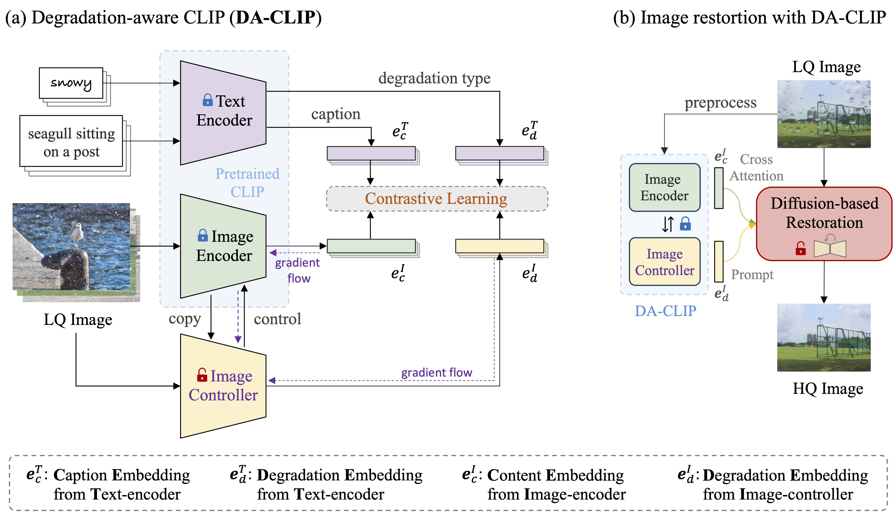

# DA-CLIP

This repository is based on the OpenAI's [CLIP](https://arxiv.org/abs/2212.07143) (Contrastive Language-Image Pre-training) and [open_clip](https://github.com/mlfoundations/open_clip). 

We extend the CLIP to a degradation-aware version ([DA-CLIP](https://arxiv.org/abs/2310.01018)) which predicts both degradation embedding and clean content embedding from corrupted images. Then we can use these embeddings to improve image restoration performance and assist unified image restoration. Moreover, we use the pretrained ViT CLIP model (**ViT-B/32 on [LAION-2B](https://laion.ai/blog/laion-5b/)**) and add an additional controller to control the image encoder.


## 一、Approach




## 二、Training DA-CLIP

### 1.Install

我们建议您首先创建一个虚拟环境，其中包括：

```bash
python3 -m venv .env
source .env/bin/activate
pip install -U pip
```

然后，您可以使用 `	pip install 'open_clip_torch[training]` 安装openclip进行训练。


### 2.Create Dataset:
要使用BLIP生成干净的字幕，我们使用clip-clip工具。使用 `pip install clip-interrogator==0.6.0` 安装并运行：

```bash
python ../scripts/generate_captions.py
```
然后，您将在 `/root/autodl-fs/datasets/universal/` 目录下获得 `daclip_train.csv` 和 `daclip_val.csv` 。

>训练时会保存实验，所以需要`da-clip/src/single_train.sh`中更改–name才能进行不同的实验。存储在./logs/args.name中
>
>运行`bash single_train.sh `之前执行export HF_ENDPOINT=https://hf-mirror.com可以下载预训练模型。

#### 2.1About Datasets

+ uncompleted :star:
+ low-light :star: 
+ rainy:star:

### 3.单进程运行代码：


```bash
cd ./src

python -m training.main \
    --save-frequency 1 \
    --zeroshot-frequency 1 \
    --report-to tensorboard \
    --train-data="datasets/universal/daclip_train.csv"  \
    --val-data="datasets/universal/daclip_val.csv"  \
    --csv-img-key filepath \
    --csv-caption-key title \
    --warmup 100 \
    --batch-size=784 \
    --lr=2e-5 \
    --wd=0.05 \
    --epochs=30 \
    --workers=8 \
    --model daclip_ViT-B-32 \
    --name "daclip_ViT-B-32_b784x1_lr2e-5_e50" \
    --pretrained "laion2b_s34b_b79k" \
    --da
```

### 4.多GPU运行代码：

我们使用 `torchrun` 来启动分布式作业。以下代码在4个GPU的节点上启动作业：

```bash
cd ./src

torchrun --nproc_per_node 4 -m training.main \
    --save-frequency 1 \
    --zeroshot-frequency 1 \
    --report-to tensorboard \
    --train-data="datasets/universal/daclip_train.csv"  \
    --val-data="datasets/universal/daclip_val.csv"  \
    --csv-img-key filepath \
    --csv-caption-key title \
    --warmup 100 \
    --batch-size=784 \
    --lr=3e-5 \
    --wd=0.05 \
    --epochs=50 \
    --workers=8 \
    --model daclip_ViT-B-32 \
    --name "daclip_ViT-B-32_b768x4_lr3e-5_e50" \
    --pretrained "laion2b_s34b_b79k" \
    --da
```
您还可以更改模型并删除 `--da` 选项以启用正常CLIP训练/微调。

### 5.Evaluation

要评估图像退化分类的性能，请运行：

```bash
cd ./src
python evaluate.py
```

## Citing

If you found this repository useful, please consider citing:

```bibtex
@article{luo2023controlling,
  title={Controlling Vision-Language Models for Universal Image Restoration},
  author={Luo, Ziwei and Gustafsson, Fredrik K and Zhao, Zheng and Sj{\"o}lund, Jens and Sch{\"o}n, Thomas B},
  journal={arXiv preprint arXiv:2310.01018},
  year={2023}
}
```

```bibtex
@inproceedings{Radford2021LearningTV,
  title={Learning Transferable Visual Models From Natural Language Supervision},
  author={Alec Radford and Jong Wook Kim and Chris Hallacy and A. Ramesh and Gabriel Goh and Sandhini Agarwal and Girish Sastry and Amanda Askell and Pamela Mishkin and Jack Clark and Gretchen Krueger and Ilya Sutskever},
  booktitle={ICML},
  year={2021}
}
```